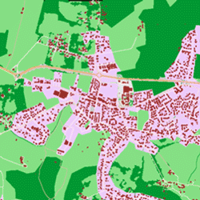
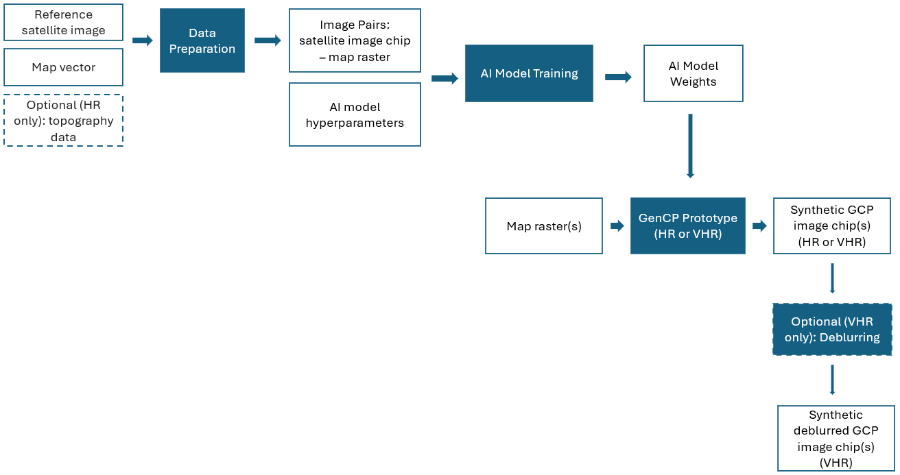

# GenCP

## Generative Control Points

AI-powered synthetic satellite image generation for geometric calibration and validation of remote sensing images.

GenCP is funded by ESA (European Space Agency).

#### Image translation from map to synthetic satellite image

## What is GenCP?

Ground Control Points (GCP) are reference measurements used in geometric Calibration / Validation of remote sensing images. Traditional approaches rely on ground-based GNSS surveys or extraction from reference raster datasets such as Sentinel-2 mosaics.

These methods face challenges: VHR reference data cannot be freely shared due to copyright, ground photos lack georeferencing, and radiometric/geometric differences between reference and target images cause accuracy loss in matching.

GenCP solves this by generating synthetic GCP images using generative AI (Pix2Pix), translating OpenStreetMap rasters into realistic satellite imagery that can serve as geometric raster references.

## Two Resolution Tracks

#### HR — High Resolution (10m)

Sentinel-2 scale imagery with optional topography (DEM/hillshade) integration to account for terrain effects.

* Mean geometric error: ~0.7 pixel (7m)
* RMSE: ~2.5 pixels (24m)

#### VHR — Very High Resolution (50cm)

UAV-scale imagery with deblurring enhancement (LaKDNet) for improved sharpness.

* Mean geometric error: ~0.6 pixel
* RMSE: ~3 pixels

## Workflow

## Demo Notebooks

Interactive notebooks are available to get started quickly:

- HR Demo - Generate 10m synthetic images
- HR + Topography Demo - HR with DEM integration
- VHR Demo - Generate 50cm synthetic images
- VHR Deblurring Demo - Deblurring enhancement

## Datasets

Training and test datasets are available on Zenodo.

---

## AI Model

GenCP is built on Pix2Pix (Image-to-Image Translation with Conditional Adversarial Networks). The original code is licensed under the BSD 3-Clause License.

References:

- Isola et al., Image-to-Image Translation with Conditional Adversarial Networks, CVPR 2017.
- Zhu et al., Unpaired Image-to-Image Translation using Cycle-Consistent Adversarial Networks, ICCV 2017.

## Video

<video style="width: 80vw;" controls>
  <source src="genCP.mp4" type="video/mp4">
</video>
